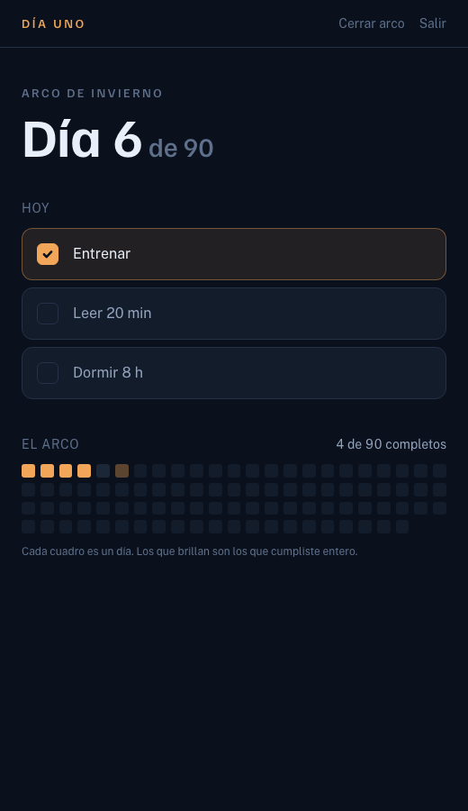

# Día Uno

> Tu arco no empieza en invierno. Empieza el día que decides ser tu mejor versión.

Un seguidor de hábitos para un tramo con principio y final. Eliges cuándo
empieza —hoy, el lunes, en enero—, qué vas a sostener, y cuántos días dura.
Después solo hay que marcar.



## Cómo se levanta

Hace falta Node 22 y un Postgres. Nada más.

```bash
pnpm install
cp .env.example .env.local        # y rellena DATABASE_URL
createdb dia_uno
psql -d dia_uno -f db/schema.sql
pnpm dev
```

Sin `RESEND_API_KEY` no se envía correo: el enlace de acceso sale por la
consola del servidor y también en pantalla. Así se puede probar el flujo
entero sin contratar nada.

## Pruebas

```bash
pnpm pruebas
```

Cubren lo que de verdad se puede romper: el cálculo del día del arco, los
cambios de mes y de año, el horario de verano, las reglas de la racha y la
geometría del arco —incluida la inversa de la elipse, que ya cazó un fallo por
el que tocabas un día y respondía otro.

## Decisiones que conviene conocer

**El día lo pone el navegador, no el servidor.** En producción el servidor
corre en UTC; si calculara ahí la fecha, a partir de las 18:00 de México ya
estaría contando el día siguiente. Por eso `Tablero` espera a montar antes de
saber qué día es, y mientras enseña un esqueleto.

**El ámbar solo marca lo cumplido.** Es el único color del producto. Si se usa
para decorar, deja de significar algo.

**Un arco vivo por persona.** Lo garantiza un índice único en la base, no la
aplicación. La idea es el compromiso con un tramo, no una lista de proyectos.

Más detalle en [docs/ARQUITECTURA.md](docs/ARQUITECTURA.md) y
[docs/MODELO-DATOS.md](docs/MODELO-DATOS.md).
